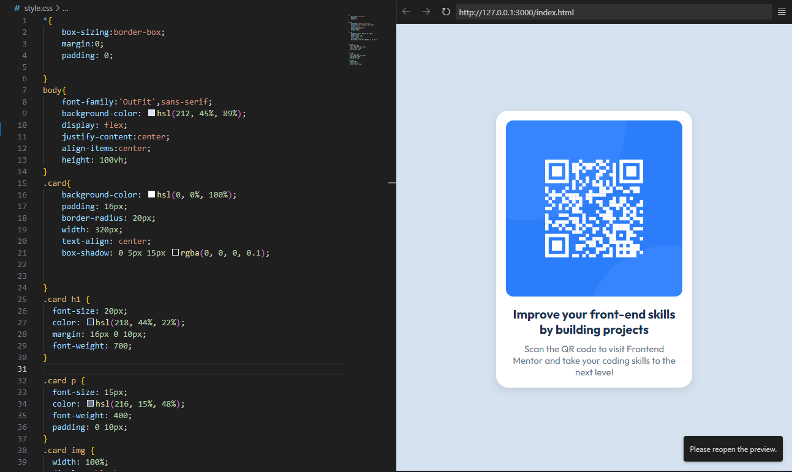

# Frontend Mentor - QR Code Component

Check out the live website here:  
👉 [https://nithishkumar0283.github.io/Frontend-Mentor-challenges/](https://nithishkumar0283.github.io/Frontend-Mentor-challenges/)

Hey there! 👋

This is my take on the [QR Code Component challenge from Frontend Mentor](https://www.frontendmentor.io/challenges/qr-code-component-iux_sIO_H). It's a simple and fun little project where I got to practice using HTML and CSS to build a clean, responsive card layout.

The goal was to create a card with a QR code image, styled according to the given design. It helped me understand things like flexbox alignment, spacing, font usage, and how to make layouts look great on both mobile and desktop.

It may look small, but it's a great building block for learning how real-world components are structured.

Thanks for checking it out! 😊


### Screenshot





## My process

### Built with

- Semantic HTML5 markup
- CSS3 (using Flexbox and custom properties)
- Google Fonts (Outfit)
- Mobile-first responsive design


### What I learned

This was my first time working on a Frontend Mentor challenge, and it helped me understand how to structure a simple component using only HTML and CSS.

Here are some of the key things I learned while building this project:

- 📦 How to center elements using **Flexbox**
- 🧠 The importance of using **semantic HTML** like `<h1>`, `<p>`, and `` with proper `alt` text
- 🎨 How to apply **HSL colors** and **border-radius** for a modern UI
- 🧱 Setting up a **mobile-first** layout that looks good on both small and large screens
- 📐 Making an image fit perfectly inside a container with `width: 100%` and `display: block`
```html
<h1>Improve your front-end skills by building projects</h1>
```
```css
.card img {
  width: 100%;
  display: block;
  border-radius: 12px;
}
```


### Continued development

Now that I’ve completed this QR code component, I’d like to continue practicing:

- Creating more responsive layouts using Flexbox and Grid
- Improving my understanding of CSS spacing, alignment, and positioning
- Working with more complex components and reusable layouts
- Learning accessibility (a11y) best practices like alt text, color contrast, and keyboard navigation
- Publishing live websites using GitHub Pages

I also plan to take on more Frontend Mentor challenges to build real-world components and improve my confidence.

## Useful resources
Frontend Mentor

Flexbox Froggy

CSS Tricks – Flexbox Guide
## Author

- Frontend Mentor – [@NITHISHKUMAR0283](https://www.frontendmentor.io/profile/NITHISHKUMAR0283)


## Acknowledgments

Thanks to [Frontend Mentor](https://www.frontendmentor.io/) for providing this beginner-friendly challenge. It was a great opportunity to practice building clean and responsive layouts.


